# ☀️ Solar Powerflow Card


Carte Lovelace de **flux d'énergie solaire animé** : production, batterie, réseau et maison.
Aucune dépendance, éditeur visuel inclus : les entités et toutes les options se règlent directement dans l'interface.

<p align="center">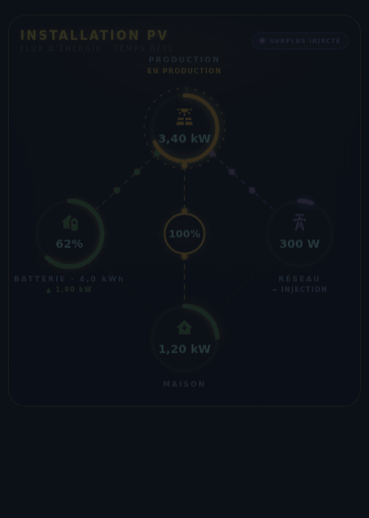</p>

<p align="center">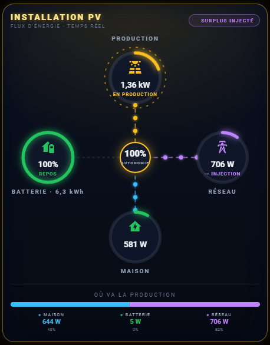</p>

## ⚠️ Avertissement

Les valeurs affichées, les flux animés et les états (surplus, charge, soutirage…) dépendent **uniquement des informations remontées par votre onduleur, votre batterie, votre compteur et votre installation photovoltaïque**, ainsi que de leur fréquence de rafraîchissement.

- Selon les marques et les intégrations, un capteur peut être absent, arrondi, décalé de quelques secondes, ou utiliser un autre sens de signe (positif ou négatif). Vérifiez ces réglages avec votre matériel.
- La carte affiche ces données telles quelles, avec les calculs décrits dans ce document. Elle ne remplace ni un compteur certifié, ni un outil de facturation.
- La répartition des **flux directs** et le **détail de la consommation** sont des **estimations**.

## 🧭 Comment fonctionne la carte

| Icône | Élément | Ce qu'il affiche |
|---|---|---|
| ☀️ | **Production** | Puissance solaire dans le cercle. Sous le titre : « EN PRODUCTION » ou « AU REPOS ». Le cercle se remplit selon `max_power`. |
| 🔋 | **Batterie** | Niveau de charge dans le cercle. Sous le titre : `▲` puissance de charge, `▼` puissance de décharge, ou « REPOS ». L'énergie stockée en kWh est ajoutée si `battery_capacity` est renseigné. |
| 🗼 | **Réseau** | Puissance échangée dans le cercle. Sous le titre : « → INJECTION » (violet), « ← SOUTIRAGE » (rouge) ou « INACTIF ». |
| 🏠 | **Maison** | Consommation instantanée. Le cercle passe au vert quand le solaire couvre toute la consommation. |
| 🎯 | **Cercle central** | Pourcentage d'**autonomie** : part de la consommation qui ne vient pas du réseau (un soutirage sous le seuil est ignoré). |
| 🏷️ | **Badge d'état** | Résumé en haut à droite, voir le tableau ci-dessous. |
| ✨ | **Animations** | Les points suivent le sens du flux. Plus la puissance est élevée, plus ils vont vite. |
| 👆 | **Clic** | Un clic sur un cercle ouvre la fiche de l'entité correspondante. |

### 🏷️ États du badge

| Badge | Condition |
|---|---|
| 🟣 SURPLUS INJECTÉ | Production > 10 W et injection > 10 W |
| 🟢 CHARGE BATTERIE | Production > 10 W et batterie en charge |
| 🟡 AUTOCONSOMMATION | Production > 10 W, tout part dans la maison |
| 🔵 SUR BATTERIE | Pas de production, batterie en décharge |
| 🔴 SOUTIRAGE RÉSEAU | Pas de production ni de batterie, et soutirage au-dessus du seuil (50 W par défaut) |
| ⚪ VEILLE | Aucun flux |

> Les puissances sont lues en W. Les capteurs en **kW** sont convertis automatiquement.
> Une entité non renseignée ou introuvable compte pour 0. Sans aucune entité trouvée, la carte s'affiche en **mode démo**.

## 🎛️ Options d'affichage

Toutes ces options sont **désactivées par défaut** : l'aspect de la carte ne change que si tu les actives, dans l'éditeur visuel ou en YAML.

### 📐 Disposition (`layout`)

| `standard` (défaut) | `compact` | `horizontal` |
|:---:|:---:|:---:|
|  | 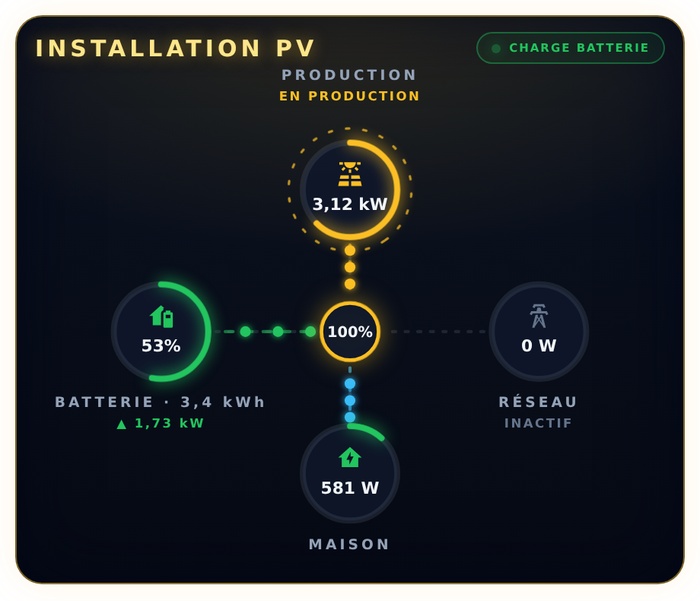 | 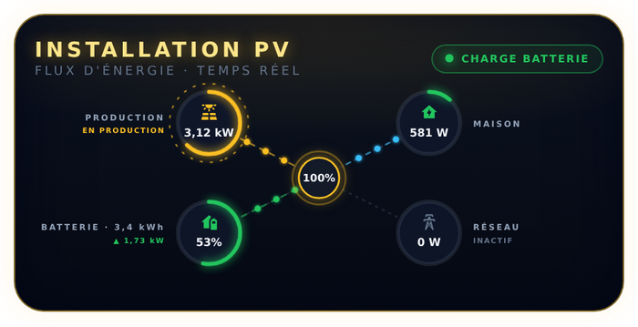 |
| Vertical, avec tous les libellés | Plus bas, cercles plus petits : petits tableaux de bord | Large et peu haute : bandeau, tablette murale |

**Disposition `mini`** : une seule ligne avec la production, la consommation (et l'autonomie), la batterie et le réseau. Sans titre, sans flux animés et sans légende. Elle respecte `show_battery` et `show_grid` : une tuile masquée disparaît et les autres se répartissent la largeur.

<p>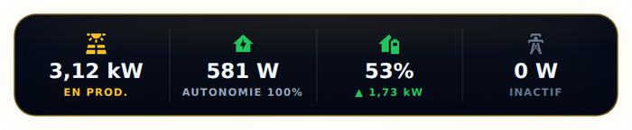 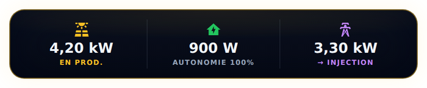</p>

### 🙈 Masquer la batterie ou le réseau (`show_battery`, `show_grid`)

Avec `show_battery: false` ou `show_grid: false`, le cercle est retiré et le reste de la carte est recentré. Sans réseau, le cercle central affiche « – » car l'autonomie ne peut plus être calculée.

<p>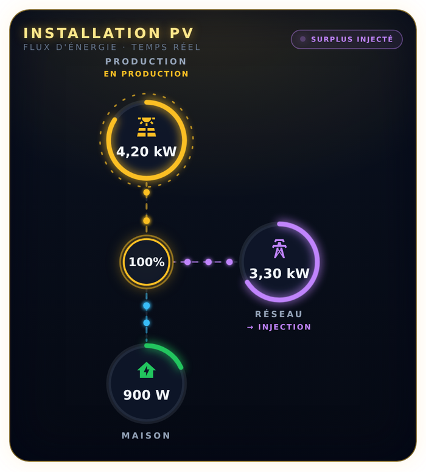</p>

### 🔀 Flux directs (`direct_flows: true`)

Au lieu de tout faire passer par le cercle central, les points relient directement :
production → batterie, production → réseau, production → maison, batterie → maison, réseau → maison.

<p>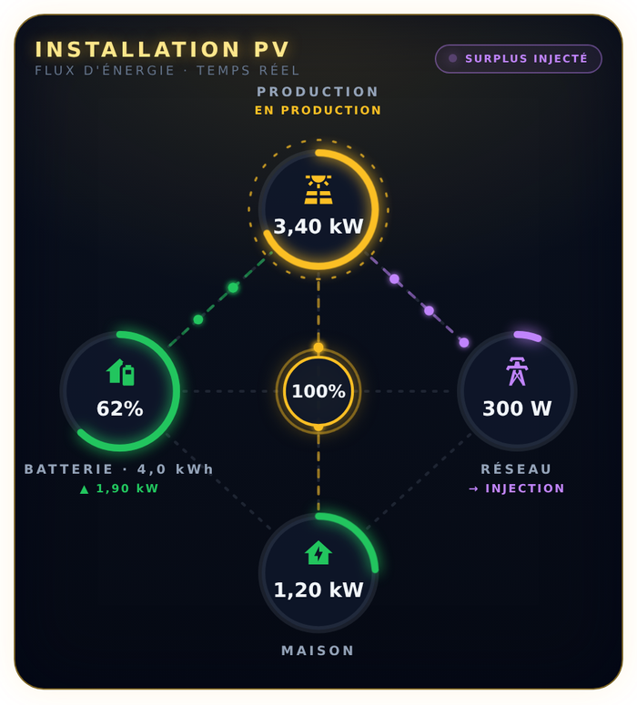</p>

> ℹ️ Les capteurs mesurent les puissances de chaque élément, pas l'origine de chaque watt. La répartition affichée est donc **estimée** : la production alimente d'abord la batterie en charge, puis le réseau (injection), puis la maison. Le reste de la consommation vient de la batterie puis du réseau.

### 🔌 Un seul capteur pour le réseau ou la batterie

Certains systèmes ne fournissent qu'**une valeur positive ou négative** au lieu de deux capteurs. Dans l'éditeur, choisissez « Un seul capteur » dans la section **Réseau** ou **Batterie**.

| Capteur | Valeur positive | Valeur négative | Pour inverser |
|---|---|---|---|
| `grid_power_entity` | **soutirage** (import) | **injection** (export) | `grid_power_invert: true` |
| `battery_power_entity` | **charge** | **décharge** | `battery_power_invert: true` |

```yaml
grid_mode: signed
grid_power_entity: sensor.puissance_reseau
battery_mode: signed
battery_power_entity: sensor.puissance_batterie
soc_entity: sensor.batterie_niveau       # le niveau de charge reste un capteur séparé
```

Si `grid_power_entity` (ou `battery_power_entity`) est renseigné sans `grid_mode` (ou `battery_mode`), le mode « un seul capteur » est appliqué automatiquement. Les capteurs en kW sont convertis en W.

### 🔻 Seuil de soutirage (`grid_import_threshold`)

Le soutirage réseau n'est signalé (flux animé, badge « SOUTIRAGE RÉSEAU », couleur rouge, autonomie réduite) qu'**au-dessus de 50 W** par défaut. En dessous, le cercle Réseau affiche la valeur mesurée avec « INACTIF ». Le seuil est réglable (minimum 10 W) et ne concerne que le soutirage : l'injection reste détectée dès 10 W.

### 🚨 Alertes visuelles

| Option | Effet | Réglage |
|---|---|---|
| `alert_battery_full` | « PLEINE » en vert avec un halo sur la batterie | `battery_full_threshold` (défaut `99` %) |
| `alert_battery_low` | « ⚠ FAIBLE » en rouge, la batterie clignote | `battery_low_threshold` (défaut `15` %) |
| `alert_no_production` | « ⚠ AUCUNE PRODUCTION » en rouge quand la production est nulle alors que le soleil est levé (hauteur > 10°) | `sun_entity` (défaut `sun.sun`) |

<p>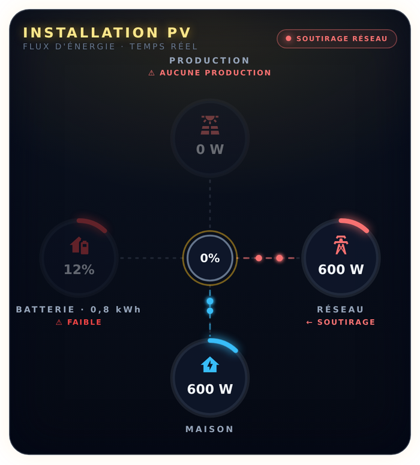</p>

### 🔌 Détail de la consommation (`consumption_breakdown: ring`)

L'anneau du cercle **Maison** se découpe en segments colorés : un par appareil, proportionnel à sa puissance du moment. Une légende sous la carte donne le nom et la puissance de chacun. Ce qui n'est pas détaillé apparaît en gris, dans « Autres ».

<p>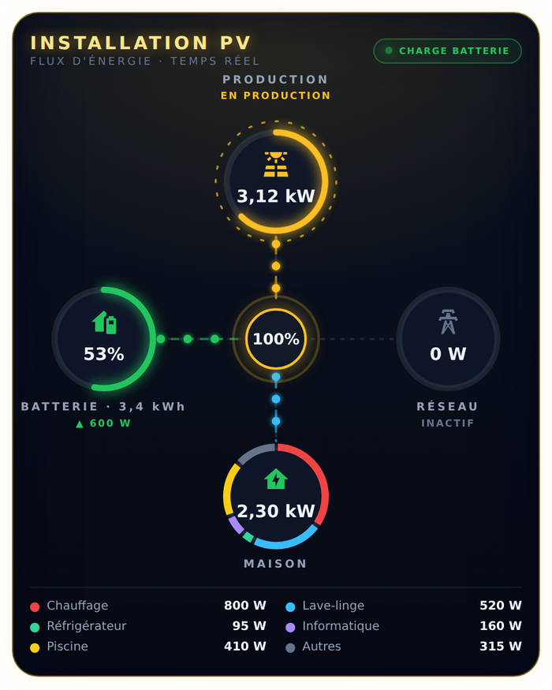 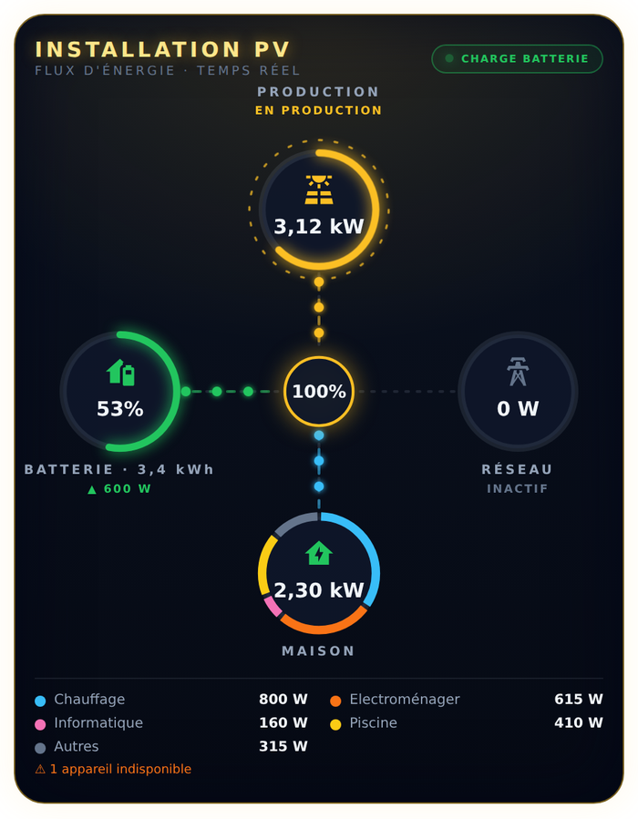</p>

**Configuration** : dans l'éditeur visuel, section « Appareils à détailler » (ajouter, supprimer, monter, descendre), ou en YAML :

```yaml
consumption_breakdown: ring
breakdown_max: 5            # appareils détaillés ; les autres sont regroupés dans « Autres »
other_label: Autres
devices:
  - entity: sensor.prise_frigo_puissance
    name: Réfrigérateur     # facultatif (sinon le nom de l'entité)
  - entity: sensor.radiateur_salon_puissance
    name: Radiateur salon
    group: Chauffage        # facultatif
    color: orange           # facultatif : nom de couleur (voir ci-dessous)
```

**Couleurs** : choisissez-les par leur nom dans l'éditeur (liste déroulante) ou en YAML : `bleu`, `rouge`, `orange`, `jaune`, `vert`, `violet`, `rose`, `turquoise`, `marron`, `blanc`. Les noms anglais (`blue`, `red`…) et le code hexadécimal (`"#f97316"`) restent acceptés. Sans couleur, une palette automatique est utilisée. Le gris est réservé à « Autres ».

| Option | Description | Défaut |
|---|---|---|
| `consumption_breakdown` | `off` ou `ring` | `off` |
| `devices` | Liste de capteurs de **puissance** (W ou kW) | – |
| `breakdown_max` | Nombre d'appareils affichés individuellement (les plus gros du moment) | `5` |
| `breakdown_legend` | Afficher la légende sous la carte | `true` |
| `group_devices` | Additionner les appareils qui ont le même `group` | `false` |
| `other_label` | Nom de la part non détaillée | `Autres` |

**Comment c'est calculé**
- « Autres » = consommation de la maison (`load_entity`) − somme des appareils affichés, jamais en dessous de 0.
- Le cercle est entièrement rempli : il montre la **répartition**, pas le niveau (le niveau est le chiffre au centre).
- Les appareils de moins de 10 W ne sont pas affichés individuellement. Avec `breakdown_max`, seuls les plus gros du moment le sont ; leur couleur reste fixe, déterminée par leur place dans la liste.
- Un appareil indisponible compte pour 0 et une mention « appareil indisponible » s'affiche.
- Sans appareil dans la liste, la carte garde son anneau habituel.

**À savoir**
- Ajoutez uniquement des mesures **indépendantes** : une multiprise et les appareils branchés dessus feraient un double comptage.
- Les capteurs ne se rafraîchissent pas tous au même moment : « Autres » peut varier un instant, ou tomber à 0 si la somme dépasse brièvement la consommation.
- Un capteur qui annonce une puissance fixe quand l'appareil est « on » (au lieu de la mesurer) rend « Autres » moins exact.
- La part « Autres » n'est pas une entité Home Assistant. Pour l'historiser, créez un capteur « template » :

```yaml
template:
  - sensor:
      - name: "Consommation non détaillée"
        unit_of_measurement: W
        device_class: power
        state_class: measurement
        state: >
          {{ [ states('sensor.consommation_maison') | float(0)
               - states('sensor.appareil_1_puissance') | float(0)
               - states('sensor.appareil_2_puissance') | float(0), 0 ] | max }}
```

## 📦 Installation

### Option A : HACS (dépôt personnalisé)
Le fichier `solar-powerflow-card.js` et `hacs.json` doivent être à la racine du dépôt GitHub.
1. HACS → ⋮ → **Dépôts personnalisés** → coller l'URL du dépôt, catégorie **Tableau de bord**.
2. Installer **Solar Powerflow Card**, puis recharger la page (Ctrl+F5).

### Option B : manuelle
1. Copier `solar-powerflow-card.js` dans `/config/www/community/solar-powerflow-card/`.
2. **Paramètres → Tableaux de bord → ⋮ → Ressources** (activer le *Mode avancé* dans le profil si besoin).
3. **Ajouter une ressource** : URL `/local/community/solar-powerflow-card/solar-powerflow-card.js`, type **Module JavaScript**.
4. Recharger avec Ctrl+F5.
5. **Modifier → Ajouter une carte** → **Solar Powerflow Card**.

## ⚙️ Configuration

Via l'éditeur visuel, organisé en sections repliables (Général, Production et consommation, Batterie, Réseau, Affichage, Alertes, Détail de la consommation) dont les champs n'apparaissent que s'ils sont utiles, ou en YAML :

```yaml
type: custom:solar-powerflow-card
title: INSTALLATION PV
pv_entity: sensor.production_solaire
load_entity: sensor.consommation_maison
soc_entity: sensor.batterie_niveau
battery_charge_entity: sensor.batterie_charge
battery_discharge_entity: sensor.batterie_decharge
grid_export_entity: sensor.reseau_injection
grid_import_entity: sensor.reseau_soutirage
max_power: 5000
battery_capacity: 6.5
# Options facultatives
layout: compact              # standard | compact | horizontal | mini
show_battery: true
show_grid: true
direct_flows: false
alert_battery_full: true
battery_full_threshold: 99
alert_battery_low: true
battery_low_threshold: 15
alert_no_production: true
sun_entity: sun.sun
grid_import_threshold: 50
consumption_breakdown: ring
devices:
  - entity: sensor.prise_frigo_puissance
    name: Réfrigérateur
    color: bleu
```

| Option | Description | Défaut |
|---|---|---|
| `title` | Titre en haut à gauche | `INSTALLATION PV` |
| `pv_entity` | Puissance de production solaire | – |
| `load_entity` | Consommation de la maison | – |
| `soc_entity` | Niveau de charge de la batterie (%) | – |
| `battery_charge_entity` | Puissance de charge de la batterie | – |
| `battery_discharge_entity` | Puissance de décharge de la batterie | – |
| `grid_export_entity` | Puissance injectée dans le réseau | – |
| `grid_import_entity` | Puissance soutirée au réseau | – |
| `grid_mode` / `battery_mode` | `separate` (deux capteurs) ou `signed` (un seul capteur positif ou négatif) | `separate` |
| `grid_power_entity` / `grid_power_invert` | Capteur réseau signé (positif = soutirage) et inversion du sens | – / `false` |
| `battery_power_entity` / `battery_power_invert` | Capteur batterie signé (positif = charge) et inversion du sens | – / `false` |
| `grid_import_threshold` | Soutirage signalé au-dessus de cette valeur (W, minimum 10) | `50` |
| `max_power` | Puissance (W) d'un cercle plein et de la vitesse maximale des animations | `5000` |
| `battery_capacity` | Capacité de la batterie (kWh). `0` pour masquer l'énergie stockée | `0` |
| `layout` | `standard`, `compact`, `horizontal` ou `mini` | `standard` |
| `show_battery` / `show_grid` | Afficher ou masquer la batterie / le réseau | `true` |
| `direct_flows` | Flux directs entre les éléments | `false` |
| `alert_battery_full` / `battery_full_threshold` | Alerte batterie pleine et son seuil (%) | `false` / `99` |
| `alert_battery_low` / `battery_low_threshold` | Alerte batterie faible et son seuil (%) | `false` / `15` |
| `alert_no_production` / `sun_entity` | Alerte « aucune production en plein jour » et entité soleil | `false` / `sun.sun` |
| `consumption_breakdown` / `devices` | Détail de la consommation par appareil (anneau coloré), voir plus haut | `off` / – |

Page explicative avec exemples : [`docs/solar-powerflow-card.html`](docs/solar-powerflow-card.html) (à télécharger puis ouvrir dans un navigateur).
